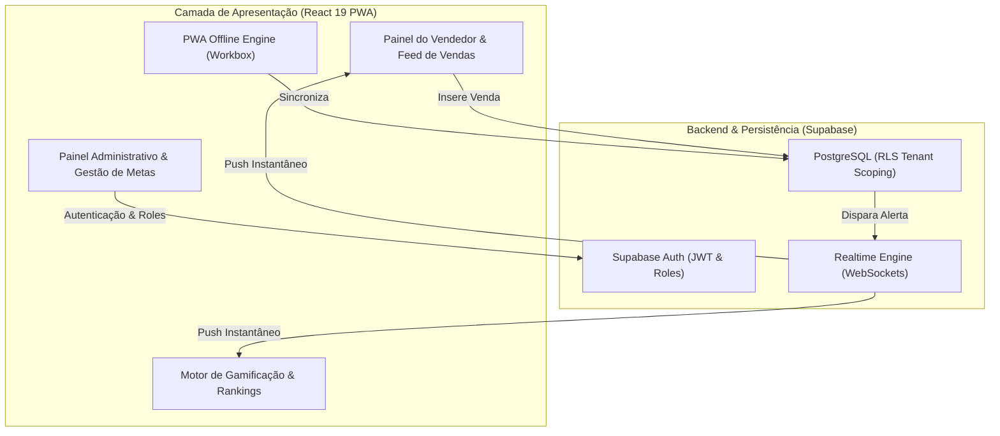

<div align="center">
  # UPZY
  
  **Plataforma SaaS de Gestão de Vendas, Assinaturas, Gestão de Metas e Gamificação Comercial**

  [](https://react.dev/)
  [](https://www.typescriptlang.org/)
  [](https://supabase.com/)
  [](https://vitejs.dev/)
  [](https://web.dev/progressive-web-apps/)
  [](https://www.upzyapp.com.br)
  [](https://upzy.vercel.app)

</div>

---

## Visão Geral do Sistema

O **UPZY** (disponível em [upzyapp.com.br](https://www.upzyapp.com.br) ou [upzy.vercel.app](https://upzy.vercel.app)) é um ecossistema SaaS para acompanhamento de vendas, controle de comissões e engajamento de equipes comerciais. A aplicação conecta gestores e vendedores em um ambiente **Multi-Tenant PWA** reativo, otimizando o acompanhamento de faturamento, metas individuais e rankings competitivos em tempo real.

A arquitetura foi desenvolvida para atender três objetivos estratégicos:
1. **Engajamento e Gamificação de Vendas**: Criação de rankings automáticos de vendedores e clientes top, acompanhamento em tempo real de metas mensais e feed de vendas instantâneo.
2. **Operação Comercial Autônoma**: Interface adaptativa PWA para lançamento rápido de vendas pelo celular ou desktop, com sincronização offline e atualização imediata via WebSockets.
3. **Gestão de Comissões e Performance**: Painel administrativo com controle de comissionamento, histórico consolidado de transações e relatórios gráficos de faturamento com Recharts.

---

## Demonstração da Interface (Screenshots)

<div align="center">

| Dashboard de Métricas e Indicadores | Gamificação (Rankings de Equipe e Clientes) |
|:---:|:---:|
|  |  |

| Gestão de Metas Comerciais | Timeline e Feed de Vendas em Tempo Real |
|:---:|:---:|
|  |  |

| Gestão de Equipe e Vendedores | Gerenciamento de Planos e Configurações |
|:---:|:---:|
|  |  |

</div>

---

## Diagrama de Arquitetura do Sistema



---

## Principais Funcionalidades

### Módulo Administrativo (Gestão Comercial)
- **Dashboard de Métricas**: Indicadores de vendas diárias, faturamento consolidado, ticket médio e gráfico de evolução temporal.
- **Gestão de Equipe e Comissões**: Cadastro de vendedores, cálculo automático de comissionamento e atribuição de papéis (Admin/Vendedor).
- **Gestão de Metas**: Definição de metas globais e individuais com barras de progresso dinâmicas.
- **Feed e Histórico Completo**: Registro em tempo real de todas as vendas realizadas pela equipe com filtros avançados.

### Módulo do Vendedor
- **Dashboard Individual**: Visualização de faturamento pessoal, projeção de comissão e status da meta mensal.
- **Lançamento Rápido de Vendas**: Formulário otimizado para registro de vendas pelo celular ou computador.
- **Rankings Competitivos**: Tabela comparativa de performance da equipe e ranking dos melhores clientes.

### Recursos Gerais e PWA
- **Progressive Web App (PWA)**: Instalação nativa em dispositivos iOS, Android e Desktop com carregamento ultrarrápido.
- **Sincronização em Tempo Real**: Atualizações reativas de vendas e rankings sem necessidade de atualização manual de tela.
- **Isolamento de Segurança**: Proteção de dados por perfil via Row Level Security (RLS).

---

## Tecnologias e Engenharia de Stack

### Frontend
- **React 19.2**: Utilização das APIs mais recentes do React para componentes de alta reatividade.
- **TypeScript 5.8 (Strict Mode)**: Tipagem estática rigorosa para garantia de integridade dos contratos de dados.
- **Vite 6.2**: Build tool ultrarrápida com Hot Module Replacement (HMR).
- **Recharts 3.5**: Biblioteca para renderização de gráficos interativos.
- **Lucide React**: Biblioteca de ícones vetoriais.
- **Vite Plugin PWA & Workbox**: Service Worker para precaching estático e suporte completo a PWA.

### Backend e Infraestrutura
- **Supabase PostgreSQL**: Banco de dados relacional com políticas de acesso Row Level Security (RLS).
- **Supabase Realtime**: Motor de WebSockets para notificação instantânea de novas vendas.
- **Supabase Auth**: Autenticação com controle hierárquico de permissões.

---

## Estrutura do Projeto

```text
UpZy/
├── components/            # Componentes React reutilizáveis de interface
│   ├── views/             # Telas principais (Dashboard, Metas, Rankings, Vendedores)
│   ├── modals/            # Modais de lançamento de vendas e edições
│   ├── ui/                # Elementos visuais base (botões, cards, inputs)
│   └── vendas/            # Componentes específicos do fluxo de vendas
├── pages/                 # Rotas da aplicação (Auth, Vendas)
├── services/              # Serviços de comunicação com a API Supabase
├── contexts/              # Contextos globais (Autenticação, Cache de Dados)
├── hooks/                 # Hooks React customizados
├── utils/                 # Formatação de moeda, datas e utilitários
├── lib/                   # Inicialização do cliente Supabase
├── types/                 # Definições de interfaces e tipos TypeScript
├── public/                # Ativos estáticos e manifesto PWA
└── package.json           # Manifesto de dependências e scripts
```

---

## Instalação e Execução Local

### Pré-requisitos
- **Node.js**: `v18.0.0` ou superior
- **npm**: `v9.0.0` ou superior

### Passos para Instalação

1. **Clonar o Repositório:**
   ```bash
   git clone https://github.com/Alan-silva01/controle-upzy.git
   cd controle-upzy
   ```

2. **Instalar Dependências:**
   ```bash
   npm install
   ```

3. **Configuração de Variáveis de Ambiente:**
   Crie o arquivo `.env` com suas credenciais do Supabase:
   ```env
   VITE_SUPABASE_URL=sua_url_do_supabase
   VITE_SUPABASE_ANON_KEY=sua_chave_anonima_do_supabase
   ```

4. **Executar em Modo de Desenvolvimento:**
   ```bash
   npm run dev
   ```
   Acesse no navegador: `http://localhost:5173` ou veja em produção em `https://www.upzyapp.com.br`.

5. **Gerar Build de Produção:**
   ```bash
   npm run build
   ```

---

<div align="center">
  <p>Desenvolvido por <strong>Alan Silva</strong> | Soluções em Automação e Software Empresarial</p>
</div>
